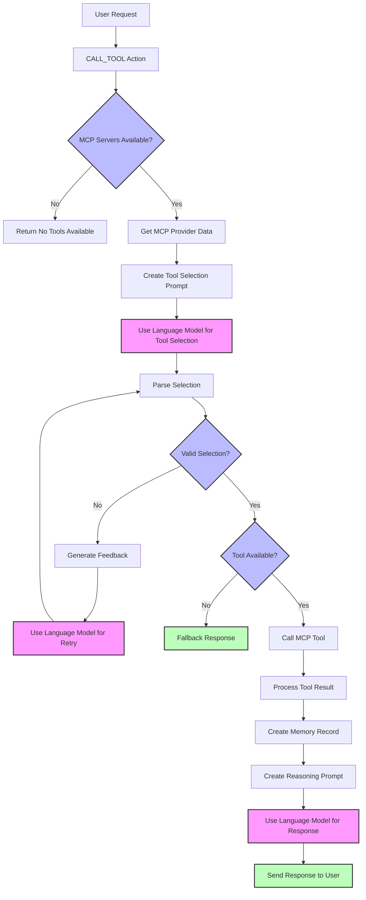

# Biostratum MCP Plugin for ElizaOS

[](https://conventionalcommits.org)

This plugin integrates the Model Context Protocol (MCP) with ElizaOS, allowing agents to connect to multiple MCP servers and use their resources, prompts, and tools. It includes specialized support for biostratum servers that provide access to biological and longevity research data.

## 🔍 What is MCP?

The [Model Context Protocol](https://modelcontextprotocol.io) (MCP) is an open protocol that enables seamless integration between LLM applications and external data sources and tools. It provides a standardized way to connect LLMs with the context they need.

This plugin allows your ElizaOS agents to access multiple MCP servers simultaneously, each providing different capabilities:

- **Resources**: Context and data for the agent to reference
- **Prompts**: Templated messages and workflows
- **Tools**: Functions for the agent to execute

## 📦 Installation

Install the plugin in your ElizaOS project:

- **npm**

```bash
npm install @longevity-genie/biostratum-mcp-plugin
```

- **pnpm**

```bash
pnpm install @longevity-genie/biostratum-mcp-plugin
```

- **yarn**

```bash
yarn add @longevity-genie/biostratum-mcp-plugin
```

- **bun**

```bash
bun add @longevity-genie/biostratum-mcp-plugin
```

## 🚀 Usage

### Option 1: Traditional MCP Configuration

Add the plugin to your character configuration:

```json
{
  "name": "Your Character",
  "plugins": ["@longevity-genie/biostratum-mcp-plugin"],
  "settings": {
    "mcp": {
      "servers": {
        "github": {
          "type": "stdio",
          "name": "Code Server",
          "command": "npx",
          "args": ["-y", "@modelcontextprotocol/server-github"]
        }
      }
    }
  }
}
```

### Option 2: Biostratum Configuration (Simplified)

For easier setup with biostratum-compatible servers:

```json
{
  "name": "Your Character",
  "plugins": ["@longevity-genie/biostratum-mcp-plugin"],
  "settings": {
    "biostratum": {
      "biothings": {},
      "opengenes": {},
      "gget": {}
    }
  }
}
```

This automatically configures biostratum MCP servers using `uvx`. All three servers (biothings, opengenes, gget) are enabled by default with all their tools available. You can also mix both configurations - biostratum and mcp servers will be merged.

## 📦 Prerequisites for Biostratum Servers

To use biostratum servers (like biothings), you need to install `uv`:

```bash
# Download and install uv
curl -LsSf https://astral.sh/uv/install.sh | sh
```

After installation, restart your terminal or run:
```bash
source ~/.bashrc  # or ~/.zshrc depending on your shell
```

## ⚙️ Configuration Options

MCP supports two types of servers: "stdio" and "sse". Each type has its own configuration options.

### Common Options

| Option     | Type    | Description                                     |
| ---------- | ------- | ----------------------------------------------- |
| `type`     | string  | The type of MCP server: "stdio" or "sse"        |
| `name`     | string  | The display name of the server                  |
| `timeout`  | number  | Timeout in seconds for tool calls (default: 60) |
| `disabled` | boolean | Whether the server is disabled                  |

### stdio Server Options

| Option    | Type     | Description                                       |
| --------- | -------- | ------------------------------------------------- |
| `command` | string   | The command to run the MCP server                 |
| `args`    | string[] | Command-line arguments for the server             |
| `env`     | object   | Environment variables to pass to the server       |
| `cwd`     | string   | _Optional_ Working directory to run the server in |

### sse Server Options

| Option    | Type   | Description                            |
| --------- | ------ | -------------------------------------- |
| `url`     | string | The URL of the SSE endpoint            |

### Biostratum Configuration

The `biostratum` section provides simplified configuration for biostratum-compatible servers. Each server key acts as an on/off switch:

```json
{
  "settings": {
    "biostratum": {
      "biothings": {
        // Optional: override default stdio configuration
        "enabled": true,
        "include": ["query_genes", "get_gene", "query_variants", "get_variant"], // Only these tools
        "exclude": ["download_entrez_data", "perform_pairwise_alignment"], // Exclude these tools
        "env": {
          "CUSTOM_VAR": "value"
        },
        "timeout": 120
      },
      "gget": {
        "include": ["gget_search", "gget_info", "gget_seq", "gget_blast", "gget_alphafold"] // Popular genomics tools
      },
      "longevity": {
        "enabled": false  // WIP server, disabled by default
      }
    }
  }
}
```

#### Available Biostratum Servers

| Server Name        | Status      | Tools | Description                                           | Default Command              |
| ------------------ | ----------- | ----- | ----------------------------------------------------- | ---------------------------- |
| `biothings`        | ✅ Ready    | 19    | Access to biological data and annotations (genes, variants, chemicals, taxa) | `uvx biothings-mcp`          |
| `opengenes`        | ✅ Ready    | 3     | Gene information related to longevity and aging research | `uvx opengenes-mcp`          |
| `gget`             | ✅ Ready    | 19    | Comprehensive genomics toolkit (search, sequences, BLAST, structure prediction) | `uvx gget-mcp`               |
| `longevity`        | 🚧 WIP      | -     | Longevity research data and interventions             | `uvx longevity-mcp`          |
| `synergy-age`      | 🚧 WIP      | -     | Aging synergy data and interactions                   | `uvx synergy-age-mcp`        |
| `druginteractions` | 🚧 WIP      | -     | Drug interaction data and analysis                    | `uvx druginteractions-mcp`   |

**Note**: 
- ✅ **Ready** servers are enabled by default and fully functional (total: 41 tools)
- 🚧 **WIP** servers are disabled by default and still in development. Set `"enabled": true` to use them.

##### Detailed Tool Breakdown

**Biothings Server (19 tools):**
- Gene tools: `query_genes`, `query_many_genes`, `get_gene`, `get_genes`, `get_gene_metadata`
- Variant tools: `query_variants`, `query_many_variants`, `get_variant`, `get_variants`
- Chemical tools: `query_chems`, `query_many_chemicals`, `get_chem`, `get_chems`
- Taxonomy tools: `get_taxon`, `get_taxons`, `query_taxons`, `query_many_taxons`
- Utility tools: `download_entrez_data`, `perform_pairwise_alignment`

**OpenGenes Server (3 tools):**
- `opengenes_get_schema_info`: Get database schema information
- `opengenes_example_queries`: Get example SQL queries  
- `opengenes_db_query`: Query longevity and aging gene database

**Gget Server (19 tools):**
- Search & Info: `gget_search`, `gget_info`, `gget_ref`
- Sequences: `gget_seq`, `gget_blast`, `gget_blat`, `gget_muscle`, `gget_diamond`
- Expression: `gget_archs4`, `gget_cellxgene`
- Function: `gget_enrichr`, `gget_elm`, `gget_bgee`
- Structure: `gget_alphafold`, `gget_pdb`
- Disease/Drugs: `gget_cosmic`, `gget_opentargets`
- Utilities: `gget_mutate`, `gget_setup`

Each server supports multiple running modes:
- **STDIO Mode** (default): `uvx <server-name>-mcp` - Used by this plugin
- **HTTP Mode**: `uvx <server-name>-mcp server --port 8000` 
- **SSE Mode**: `uvx <server-name>-mcp sse`

#### Tool Filtering

You can control which tools are available from each server using include/exclude patterns:

| Option    | Type       | Description                                    | Default |
| --------- | ---------- | ---------------------------------------------- | ------- |
| `include` | string[]   | Only include tools with these exact names     | `[]` (include all) |
| `exclude` | string[]   | Exclude tools with these exact names          | `[]` (exclude none) |

**Filtering Logic:**
1. If no `include`/`exclude` options are specified → all server tools are available
2. If `include` is specified and not empty → only include tools with matching names
3. If `exclude` is specified and not empty → exclude tools with matching names (applied after include)
4. Missing/mismatched tool names don't cause errors

**Example configurations:**
```json
{
  "biothings": {
    "include": ["query_genes", "get_gene", "query_variants", "get_variant"]  // Only gene and variant tools
  },
  "opengenes": {
    "exclude": ["opengenes_db_query"]  // All tools except direct SQL queries
  },
  "gget": {
    "include": ["gget_search", "gget_info", "gget_seq", "gget_alphafold"]  // Core genomics workflow tools
  }
}
```

## 🛠️ Using MCP Capabilities

Once configured, the plugin automatically exposes MCP servers' capabilities to your agent:

### Context Providers

The plugin includes three providers that add MCP capabilities to the agent's context:

1. `MCP_SERVERS`: Lists available servers and their tools, resources and prompts

## 🔄 Plugin Flow

The following diagram illustrates the MCP plugin's flow for tool selection and execution:



## 📋 Example: Setting Up Multiple MCP Servers

Here's a complete example configuration with multiple MCP servers using both traditional MCP configuration and biostratum:

```json
{
  "name": "Developer Assistant",
  "plugins": ["@longevity-genie/biostratum-mcp-plugin", "other-plugins"],
  "settings": {
    "mcp": {
      "servers": {
        "github": {
          "type": "stdio",
          "command": "npx",
          "args": ["-y", "@modelcontextprotocol/server-github"],
          "env": {
            "GITHUB_PERSONAL_ACCESS_TOKEN": "<YOUR_TOKEN>"
          }
        },
        "puppeteer": {
          "type": "stdio",
          "command": "npx",
          "args": ["-y", "@modelcontextprotocol/server-puppeteer"]
        }
      },
      "maxRetries": 2
    },
    "biostratum": {
      "biothings": {
        "include": ["query_genes", "get_gene", "query_variants", "get_variant"],
        "timeout": 120
      },
      "opengenes": {
        "exclude": ["opengenes_db_query"]
      },
      "gget": {
        "include": ["gget_search", "gget_info", "gget_seq", "gget_blast", "gget_alphafold"]
      },
      "longevity": {
        "enabled": true
      }
    }
  }
}
```

You can also use only biostratum configuration:

```json
{
  "name": "Biomedical Assistant",
  "plugins": ["@longevity-genie/biostratum-mcp-plugin"],
  "settings": {
    "biostratum": {
      "biothings": {
        "exclude": ["download_entrez_data", "perform_pairwise_alignment"]
      },
      "opengenes": {
        "include": ["opengenes_get_schema_info", "opengenes_example_queries"]
      },
      "gget": {
        "include": ["gget_search", "gget_info", "gget_seq", "gget_blast", "gget_alphafold", "gget_cosmic", "gget_opentargets"]
      }
    }
  }
}
```

## 🔒 Security Considerations

Please be aware that MCP servers can execute arbitrary code, so only connect to servers you trust.

## 🔍 Troubleshooting

If you encounter issues with the MCP plugin:

1. Check that your MCP servers are correctly configured and running
2. Ensure the commands are accessible in the ElizaOS environment
3. Review the logs for connection errors
4. Verify that the plugin is properly loaded in your character configuration

## 👥 Contributing

Thanks for considering contributing to our project!

### How to Contribute

1. Fork the repository.
2. Create a new branch: `git checkout -b feature-branch-name`.
3. Make your changes.
4. Commit your changes using conventional commits.
5. Push to your fork and submit a pull request.

### Commit Guidelines

We use [Conventional Commits](https://www.conventionalcommits.org/) for our commit messages:

- `test`: 💍 Adding missing tests
- `feat`: 🎸 A new feature
- `fix`: 🐛 A bug fix
- `chore`: 🤖 Build process or auxiliary tool changes
- `docs`: ✏️ Documentation only changes
- `refactor`: 💡 A code change that neither fixes a bug or adds a feature
- `style`: 💄 Markup, white-space, formatting, missing semi-colons...

## 📄 License

This plugin is released under the same license as ElizaOS.